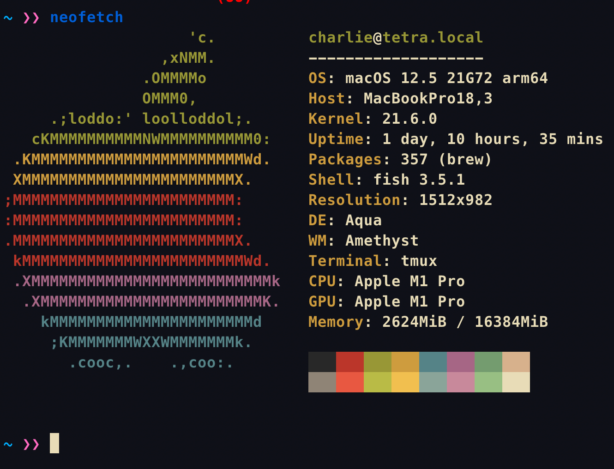

# Week 0 Homework

## Installation
Please view [week0 installation](../installation/week0.md) for instructions on how to install everything needed for week0.


## Form
Please fill out the form / or send me your github username to be added to the team's repo. 
The links are: https://forms.gle/7xPFEEouiEviU9vo8, https://github.com/RTAOLP/week0_section1, https://github.com/RTAOLP/week0_section2

## Notes
Please take a look at the notes in the [week0 notes](../notes/week0.md) for instructions the cli.

!!! note

    The basics of bash will be covered in the next lesson, however, I would like you to do some experimenting yourself.


# Homework

There are three parts to this homework. This is the only week where there will be more reading/exercises than coding. Remember Part 2 and Part 3 are graded on completion only.Everything should be submitted on github. Specifically to your section's repo. 

## Submitting Homework
All homework should be submitted to your section's repo through the git submodule version shown in the [week0 installation guide](../installation/week0.md#git-and-github---submodule-setup) instructions.

- the name of your submodule should be `lastname-firstname`
- everything should be committed to your own repo, I'll update the main repo when I'm grading everything. Don't worry about committing to the main repo once you set up your git submodule.
- If anything takes more than an hour, you are free to not do the assignment.


### Part 1
1. Can you note anything you see on clear? What is the difference between my setup and your clear session? Upload your observations to the week0 notes as "part_1_notes.txt"

2. Install neofetch on clear and run it!
```
$ git clone https://github.com/dylanaraps/neofetch
$ cd neofetch
$ make PREFIX=./ install
```

Upload this output to the week0 notes as "neofetch.img".

Your output should look something like this:



```
git add part_1_notes.png
git add neofetch.img
git commit -m "part 1"
git push
```

### Part 2
Watch a 14 minute clip from [this video](https://youtu.be/tc4ROCJYbm0?t=300) and submit and push a file called "part_2_notes.txt" with anything you noticed. Specifically watch from 5:00 to 19:00. If you have time I would recommend you watching the whole thing.

That is 
```
git add part_2_notes.txt
git commit -m "part 2 notes"
git push
```


### Part 3
Please read this article http://www.paulgraham.com/hp.html and submit a file called "part_3_notes.txt" with anything you noticed.
That is 
```
git add part_3_notes.txt
git commit -m "part 3 notes"
git push
```

You are done! Remember just submitting something will boost your grade.
